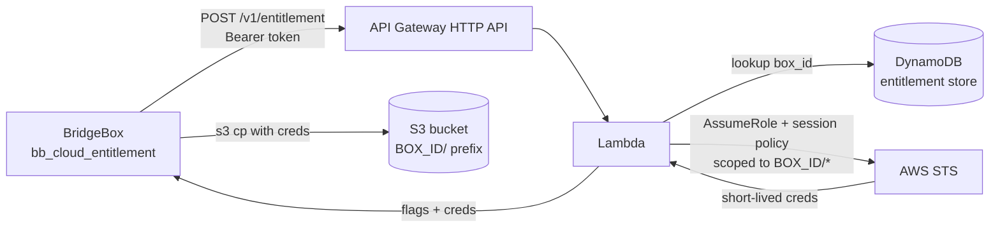

# Requirements — BridgeBox Cloud Backup Entitlement Endpoint (Lambda + STS)

> Scope note: this document specifies the **vendor-hosted backend** for the optional cloud backup
> feature. It is NOT built in this repo — `bridge-box` stays shell + systemd. The backend lives in a
> separate repo/stack: **`bridge-box-eligibility`** (AWS SAM, Python Lambda), which implements this
> spec (a copy of this file lives there as `REQUIREMENTS.md`, its source of truth). The box-side
> client that consumes this endpoint is `bridge-box-cloud-lib.sh` (`bb_cloud_entitlement`),
> `bridge-box-cloud-backup.sh`, and `bridge-box-cloud-restore.sh` in this repo.

## 1. Purpose & Scope

A single HTTPS endpoint, hosted in the vendor AWS account, that decides **per box** whether cloud
backup and restore are permitted, and vends **short-lived, prefix-scoped** S3 credentials so a box
can upload/download only its own snapshots. This is the paid-feature gate: the vendor controls
entitlement centrally, and **no long-lived AWS credentials ever live on a Pi**.

In scope: the HTTPS API, its authentication, the entitlement store, STS credential vending, the
IAM/S3 policy design, and observability. Out of scope: the box-side client (this repo) and the
backup/restore data flow itself.

## 2. Definitions

- **BOX_ID** — stable, provisioning-time identifier for a club/box (e.g. `club123`). Keys the S3
  prefix `s3://<bucket>/<BOX_ID>/`. Set at install via the `BOX_ID` env var; recorded in the box's
  `cloud-backup.conf`. Constrained on the box to `[A-Za-z0-9._-]`.
- **Entitlement** — vendor-controlled record per BOX_ID: `{backup: bool, restore: bool}` plus an
  active/suspended `status` (e.g. for non-payment).
- **Bearer token** — per-box secret provisioned into `cloud-backup.conf` as `CLOUD_TOKEN`, presented
  to the endpoint to authenticate as a specific BOX_ID.

## 3. API Contract

One logical operation, called by the box at the start of a backup or restore run.

- **Method / Path:** `POST /v1/entitlement` (HTTPS only; plain HTTP refused).
- **Auth header:** `Authorization: Bearer <CLOUD_TOKEN>`.
- **Request body (JSON):**
  ```json
  { "box_id": "club123", "op": "backup" }
  ```
  `op` is `backup`, `restore`, or `logs` — lets the endpoint vend minimally-scoped credentials per
  operation.
- **Success response (HTTP 200):**
  ```json
  {
    "box_id": "club123",
    "backup": true,
    "restore": false,
    "logs": false,
    "bucket": "bridgebox-backups-prod",
    "region": "eu-west-2",
    "prefix": "club123/",
    "credentials": {
      "access_key_id": "ASIA...",
      "secret_access_key": "...",
      "session_token": "...",
      "expiration": "2025-01-01T12:15:00Z"
    }
  }
  ```
  `credentials` is omitted when the requested `op` is not permitted.
- **Authenticated but not permitted (HTTP 200, no creds):** a suspended / non-paying box (or one not
  entitled to the requested op) gets the flags (`{"backup": …, "restore": …, "logs": …}`) and no
  `credentials`. The box treats this as a clean no-op.
- **Error responses:** `401` (missing/invalid token), `403` (token valid but box unknown, or the
  body's `box_id` doesn't match the token's box), `400` (malformed body / bad `op`), `429` (rate
  limited), `5xx` (transient). The box treats any non-2xx as "not entitled, exit 0", so errors are
  safe by construction.

**CONTRACT REQUIREMENT (must match the box parser).** The 200 body MUST use exactly these field
names, because `bb_cloud_entitlement()` parses them:
`backup`, `restore`, `logs`, `bucket`, `region`, `prefix`, and
`credentials.access_key_id` / `credentials.secret_access_key` / `credentials.session_token`
(`credentials.expiration` is informational). The `logs` flag was **added additively on `/v1/`** — a
box that only sends `backup`/`restore` simply ignores the extra field, so this is backward
compatible. A change to any EXISTING name/shape is still a breaking change requiring `/v2/...`.

## 4. Functional Requirements

- **FR1 — Authenticate the box.** Validate the bearer token and map it to exactly one BOX_ID. A
  token MUST NOT act on a different BOX_ID than it was issued for: if the request body's `box_id`
  doesn't match the token's box, return `403`.
- **FR2 — Look up entitlement.** Read `{backup, restore, status}` for the box. `status != active`
  forces both flags to `false` regardless of the stored booleans.
- **FR3 — Vend scoped, short-lived credentials.** For a permitted op, call STS `AssumeRole` with a
  **session policy** restricting the returned credentials to the box's prefix
  (`s3://<bucket>/<BOX_ID>/*`, or the narrower `.../<BOX_ID>/logs/*` for `logs`). Credentials MUST be
  short-lived (≤ 15 min is sufficient for one run).
- **FR4 — Per-op least privilege.** `op:backup` credentials allow `s3:PutObject`, `s3:GetObject`,
  `s3:DeleteObject` (for snapshot/object retention) under the prefix plus a prefix-scoped
  `s3:ListBucket`; `op:restore` credentials allow `s3:GetObject` + prefix-scoped `s3:ListBucket`
  only; `op:logs` credentials allow **`s3:PutObject` ONLY**, scoped to `<BOX_ID>/logs/*` — logs are
  **write-only** from the box (no read/list/delete; the vendor reads and prunes logs server-side). No
  cross-box access under any circumstances.
- **FR5 — Central disable.** Setting a box to `status: suspended` (or `backup:false`/`restore:false`)
  MUST cause the very next call to return no credentials. Because vended credentials are short-lived,
  an in-flight box loses access within minutes — no key rotation required.
- **FR6 — Stateless per call.** Each call is independent; no server-side session beyond the
  entitlement store.

## 5. Security Requirements

- **SR1** — HTTPS/TLS 1.2+ only; reject plaintext.
- **SR2** — Tokens stored **hashed** at rest (salted hash); never logged. Requests/responses MUST NOT
  log the token or STS secret/session values. Log by BOX_ID and a token *identifier*, not the token.
- **SR3** — The vended role's trust policy allows assumption only by the Lambda execution role. The
  **session policy is the hard boundary** preventing prefix escape; the role's own policy must also
  be scoped to the backups bucket.
- **SR4** — Bucket hardening: Block Public Access on; default encryption (SSE-S3 or SSE-KMS);
  TLS-only bucket policy (`aws:SecureTransport`); consider versioning + lifecycle as defense against
  accidental/malicious deletion.
- **SR5** — Rate-limit per token / BOX_ID (API Gateway throttling or in-Lambda) to bound abuse if a
  token leaks.
- **SR6** — Data privacy: enabling this sends player/game data off-box (matches the opt-in privacy
  caveat in the steering off-box decision). Prefix isolation (FR3/FR4) is the control that stops one
  club's data reaching another.
- **SR7** — Token rotation: support issuing a new token for a BOX_ID and revoking the old one with no
  downtime (the store may hold more than one active token per box during rotation).

## 6. AWS Architecture

API Gateway (HTTP API) → Lambda (entitlement resolver + STS vendor) → DynamoDB (entitlement store) +
STS. An S3 bucket `bridgebox-backups-<env>` holds per-box prefixes: `<BOX_ID>/objects/…`
(content-addressed per-DB objects), `<BOX_ID>/manifest.json` (the current set), and
`<BOX_ID>/manifests/…` (history). Two IAM roles: (a) the Lambda **execution role** (read DynamoDB,
`sts:AssumeRole` on the vending role, write logs); (b) the **backup-access role** assumed per request
and constrained by the session policy to one prefix.



### Entitlement store (DynamoDB) — suggested schema
- **PK:** `box_id` (string).
- **Attributes:** `status` (`active` | `suspended`), `backup` (bool), `restore` (bool), `logs` (bool
  — off-box app-log shipping; separate opt-in, defaults false because logs may carry player/game
  data), `token_hashes` (string set — hashed tokens, supports rotation), `created_at`, `updated_at`,
  optional `plan` / `notes`.
- **Admin path:** a small script or console edit to set `status` / flags — this is the "remote
  control" surface the vendor uses to switch a paying box on or a lapsed box off.

## 7. Non-Functional Requirements

- **NFR1 — Offline-first friendliness:** endpoint downtime must be harmless to boxes. A failed call
  means "no cloud this run"; the box keeps serving and keeps its local backups. No hard uptime SLA is
  required for box operation.
- **NFR2 — Latency:** p95 < 1s per call. Boxes call once per backup/restore run (at boot), so
  throughput is low (fleet size × boots/day).
- **NFR3 — Cost:** serverless, scale-to-zero; negligible at fleet scale.
- **NFR4 — Region:** a single region is acceptable (e.g. `eu-west-2`). Document it, because the box
  stores and uses the `region` from the response.
- **NFR5 — Observability:** CloudWatch logs/metrics for allow/deny counts, per-BOX_ID call counts,
  STS failures, and 4xx/5xx rates. Alarm on elevated 5xx.

## 8. Provisioning & Lifecycle

- **PR1 — Token issuance.** Issuing a box a token also creates/updates its DynamoDB record. This is a
  documented admin operation (script or console) that outputs the values a club admin drops into
  `cloud-backup.conf`: `BOX_ID`, `CLOUD_TOKEN`, `CLOUD_BUCKET`, `CLOUD_REGION`, `CLOUD_ENDPOINT`.
- **PR2 — Swap continuity.** Provisioning a replacement box with the **same BOX_ID** and a valid
  token grants it the old box's prefix — this is what makes restore-on-provision "just work". The
  recommended swap procedure: issue a fresh token for the same BOX_ID and revoke the dead box's
  token.
- **PR3 — Deprovision.** A documented way to `suspend` a box (stops backup/restore on the next call)
  and, separately, to delete its S3 data on cancellation, subject to a retention/grace policy
  (vendor decision).

## 9. Testing Requirements

- **T1 — Contract test:** assert the 200 response shape matches `bb_cloud_entitlement()`'s parser
  exactly (field names + `credentials` nesting). This test is the guard against drift between backend
  and box.
- **T2 — Auth:** valid token → mapped BOX_ID; missing/invalid token → 401; token/BOX_ID mismatch →
  403.
- **T3 — Entitlement:** `active`+`backup:true` vends backup creds; `suspended` vends none; `restore`
  op with `restore:false` vends none; `logs` op with `logs:true` vends a **write-only** policy
  (`PutObject` only under `<box>/logs/*`, no Get/List/Delete), and `logs:false` vends none.
- **T4 — Isolation (CRITICAL):** credentials vended for `club123` MUST fail any S3 op against
  `club999/`. For `logs` creds, additionally confirm they cannot Get/List/Delete even within the
  box's own prefix (write-only). Automate against a real or mocked S3 (session-policy boundary).
- **T5 — Expiry:** vended credentials are rejected after `expiration`.
- **T6 — End-to-end:** point `bb_cloud_entitlement()` at a deployed dev endpoint and confirm a full
  backup + restore round-trip.

## 10. Open Decisions / Assumptions

- **Box auth model = per-box bearer token** (confirmed). If a signed-request / HMAC model is chosen
  later, FR1 / SR2 / SR7 adjust accordingly.
- **KMS vs SSE-S3** for at-rest encryption (KMS adds per-key auditing/rotation at slightly more cost).
- **S3 versioning + lifecycle vs application-level `SNAPSHOT_KEEP` pruning.** The box already prunes
  logical snapshots to `SNAPSHOT_KEEP`; versioning would additionally guard against tampering. Doing
  both is reasonable.
- **Backend code/IaC location:** a separate repo/stack (SAM or CDK), not `bridge-box`.

## 11. Box-side cross-reference

The box consumes this endpoint through a single function so the contract stays in one place:
- `bridge-box-cloud-lib.sh` → `bb_cloud_entitlement <backup|restore|logs>`: POSTs `{box_id, op}` with
  the bearer token, parses the response fields listed in §3, and exports `AWS_ACCESS_KEY_ID` /
  `AWS_SECRET_ACCESS_KEY` / `AWS_SESSION_TOKEN` (+ `AWS_DEFAULT_REGION`) for the AWS CLI.
- `bridge-box-log-ship.sh` uses `op=logs` to ship app-log batches to `<box>/logs/` (write-only,
  separate opt-in via `LOG_SHIP_S3` in `log-ship.conf`).
- Config on the box (`/home/bridgebox/cloud-backup.conf`, chmod 600): `BOX_ID`, `CLOUD_BUCKET`,
  `CLOUD_REGION`, `CLOUD_ENDPOINT`, `CLOUD_TOKEN`, `SNAPSHOT_KEEP`.
- Consumers: `bridge-box-cloud-backup.sh` (uploads changed DBs as content-addressed
  `objects/<rel>.<sha256>.sqlite.gz` + a `manifest.json`/`manifests/<stamp>.json`, keeps the newest
  `SNAPSHOT_KEEP` manifests and GCs unreferenced objects) and `bridge-box-cloud-restore.sh`
  (downloads `manifest.json`, then each referenced object, verifies `sha256` + integrity, restores
  into `data/`).

> Note on scope: the STS session policy scope (`s3://<bucket>/<BOX_ID>/*`, FR3) is unchanged by the
> object+manifest layout — it already covers `objects/`, `manifest.json`, and `manifests/`. The
> `s3:DeleteObject` grant for `op:backup` (FR4) now also covers manifest-retention pruning and
> object garbage-collection.
